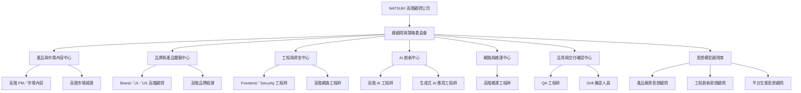

# NATSUKI 高階顧問公司

## 組織架構、角色職位與一體化服務維度

> **文件性質：** NATSUKI 內部組織設計草案
> **版本：** v1.0
> **日期：** 2026 年 8 月 27 日
> **核心領域：** 網頁設計、市場策略、產品設計、品牌建構、AI 應用、安全工程與維運

---

## 一、公司定位

**NATSUKI 高階顧問公司**是一間以「品牌、產品、技術與成長」為一體的數位顧問公司。公司不只提供單點式的網頁設計或行銷服務，而是從市場洞察開始，逐步完成品牌定位、產品策略、使用者體驗、前端開發、資安防護、AI 導入、上線維運與品質驗證，協助客戶把想法轉化為可被使用、可被信任、可被擴張的數位產品。

NATSUKI 的工作方式是將策略與執行放在同一個決策系統中。市場團隊負責確認「做什麼以及為誰而做」，品牌與產品團隊負責確認「如何被理解與使用」，工程團隊負責確認「能否安全、穩定且有效率地實現」，維運與 QA 團隊則負責確認「能否長期運作並持續改善」。

### 公司使命

> 以高階策略、卓越設計與可靠技術，打造能夠被市場看見、被使用者喜愛、被企業信任，並且能持續成長的數位產品。

### 公司願景

NATSUKI 將成為亞洲具代表性的「品牌到產品、產品到成長」整合型顧問公司，專注於高品質網站、數位服務、AI 應用與長期營運系統的設計與建構。

---

## 二、NATSUKI 的單一核心維度

為了避免各部門各自努力、卻無法形成成果，NATSUKI 採用一個統一的核心維度：

# Brand-to-Scale：從品牌洞察到產品規模化成長

這是一條從 **市場問題** 出發，經過 **品牌意義、產品體驗、技術實現、AI 增能、穩定營運與品質驗證**，最後回到 **市場結果** 的閉環。所有顧問角色都必須能回答同一個問題：

> **這項決策是否能讓客戶的品牌更清楚、產品更好用、技術更可靠，並且帶來可持續的市場成長？**

| 核心階段 | 關鍵問題 | 主要負責角色 | 主要產出 |
|---|---|---|---|
| Insight 市場洞察 | 客戶真正的市場機會與使用者問題是什麼？ | 高階 PM、高階市場經理 | 市場洞察、受眾分群、競品與需求分析 |
| Meaning 品牌意義 | 品牌要代表什麼，為何值得被選擇？ | 高階品牌經理、品牌思想顧問 | 品牌定位、品牌敘事、價值主張 |
| Experience 產品體驗 | 使用者如何理解、操作並信任產品？ | Brand／UI／UX 顧問、產品願景顧問 | 資訊架構、使用者流程、UI 系統、原型 |
| Build 技術建構 | 如何把體驗安全、快速、可維護地實現？ | 前端／Security 工程師、網路工程師 | 前端系統、資安設計、技術架構 |
| Intelligence AI 增能 | AI 如何轉化為實際的產品與營運價值？ | 高階 AI 工程師、生成式 AI 應用工程師 | AI 功能、提示流程、知識系統、模型整合 |
| Run 穩定營運 | 產品如何穩定上線、監控並持續服務？ | 高階維運工程師、網路工程師 | CI/CD、監控、備援、事件處理 |
| Assurance 品質確認 | 如何確保成果符合需求且可被信任？ | QA 工程師、Grill 確認人員 | 測試報告、驗收清單、風險決議 |
| Scale 成長擴張 | 如何以數據與回饋改善並擴大成果？ | PM、市場、品牌、AI 與維運團隊 | 成長計畫、優化迭代、擴張藍圖 |

---

## 三、組織架構

---

## 四、高階職位與角色分配

### 1. 總顧問與策略委員會

| 角色 | NATSUKI 職位 | 核心任務 |
|---|---|---|
| NATSUKI 總顧問 | Chief Advisory Officer | 統一公司方向，整合市場、品牌、產品、技術、AI 與維運決策，確保所有工作符合 Brand-to-Scale 核心維度。 |
| 策略委員會 | Executive Strategy Council | 審查重大專案、資源配置、品牌方向、技術風險、AI 導入與交付品質。 |

總顧問的責任不是取代各專業主管，而是讓不同專業在同一個目標下協作。當市場機會、品牌一致性、產品體驗、工程可行性或交付時程彼此衝突時，總顧問負責建立判斷順序與最終決策紀錄。

### 2. 產品與市場內容中心

| 使用者指定角色 | NATSUKI 正式職位 | 職位定位與責任 |
|---|---|---|
| PM／市場內容、高階 PM | **首席產品與市場內容官（Chief Product & Market Content Officer）** | 負責將市場需求轉化為產品方向、網站架構、內容策略與執行優先級；建立產品路線圖、需求文件、專案節奏與跨部門協作機制。 |
| 高階市場經理、哈佛博士 | **首席市場策略顧問（Principal Market Strategy Advisor）** | 負責市場定位、受眾研究、競爭分析、商業機會與成長策略。此處的「哈佛博士」是本公司對高階研究能力與學術訓練的職能規格描述，不代表對任何實際個人學歷的宣稱。 |

首席產品與市場內容官是專案的「問題定義者」。他必須先釐清目標客群、商業目標、成功指標與內容層級，再將需求交給品牌、UX 與工程團隊，避免團隊在缺乏策略方向的情況下直接開始製作頁面。

### 3. 品牌與產品體驗中心

| 使用者指定角色 | NATSUKI 正式職位 | 職位定位與責任 |
|---|---|---|
| Brand／UI／UX、高階工程師 | **首席品牌體驗與 UI／UX 工程顧問（Principal Brand Experience & UI/UX Engineer）** | 統籌品牌視覺、資訊架構、使用者流程、互動原型、設計系統與前端可實現性，確保品牌語言能在產品介面中被一致地體驗。 |
| 高階品牌經理、哈佛品牌專研博士 | **首席品牌策略與研究顧問（Principal Brand Strategy & Research Advisor）** | 負責品牌定位、品牌個性、品牌識別、品牌敘事與品牌資產管理。此處的「哈佛品牌專研博士」是高階品牌研究能力的角色規格，不代表對任何實際個人學歷或任職的宣稱。 |

品牌團隊不只負責配色、標誌與視覺風格，也必須決定客戶在接觸網站時應該形成什麼印象、信任感與行動意願。UI／UX 團隊則把這些抽象價值轉化為清楚的頁面層級、互動回饋與可理解的使用流程。

### 4. 工程與資安中心

| 使用者指定角色 | NATSUKI 正式職位 | 職位定位與責任 |
|---|---|---|
| Frontend／Security 工程師 | **前端與應用安全總工程師（Principal Frontend & Application Security Engineer）** | 負責前端架構、元件系統、效能、無障礙、權限邏輯、輸入驗證、資料保護與應用層資安檢查。 |
| 高階網路工程師 | **首席網路與雲端架構師（Principal Network & Cloud Architect）** | 負責網路拓撲、DNS、憑證、CDN、雲端資源、WAF、存取控制、備援與跨環境連線。 |

工程與資安中心必須在設計早期介入，而不是等到網站完成後才補做安全檢查。工程團隊的基本原則是「安全預設、清楚邊界、可觀測、可回復」，任何需要處理使用者資料、付款、帳號、AI 輸入或第三方服務的功能，都必須在需求階段記錄其風險與防護方式。

### 5. AI 創新中心

| 使用者指定角色 | NATSUKI 正式職位 | 職位定位與責任 |
|---|---|---|
| 高階 AI 工程師 | **首席 AI 平台與模型工程師（Chief AI Platform & Model Engineer）** | 負責 AI 技術策略、模型選型、資料與知識流程、評估機制、成本控制、可靠性與 AI 平台架構。 |
| 生成式 AI 應用工程師 | **生成式 AI 產品應用總工程師（Principal Generative AI Application Engineer）** | 負責將生成式 AI 導入網站、客服、內容、搜尋、工作流程與內部工具，設計提示流程、工具調用、知識檢索與人機協作體驗。 |

AI 創新中心不以「使用 AI」作為目的，而以可衡量的使用者與商業價值為判準。所有 AI 功能都應說明輸入來源、輸出用途、人工覆核點、錯誤處理、資料保存方式與停止使用的條件。

### 6. 網路與維運中心

| 使用者指定角色 | NATSUKI 正式職位 | 職位定位與責任 |
|---|---|---|
| 高階維運工程師 | **首席維運與可靠性工程師（Principal Site Reliability & Operations Engineer）** | 負責部署流程、CI／CD、日誌、監控、告警、備份、災難復原、事件應變與服務等級目標。 |

維運中心的成功標準不只是「網站可以上線」，而是網站能被持續觀測、快速修復、穩定更新並在故障後恢復。每一個正式上線的專案都必須具備部署紀錄、回滾方式、監控指標、事件聯絡人與備份驗證結果。

### 7. 品質與交付確認中心

| 使用者指定角色 | NATSUKI 正式職位 | 職位定位與責任 |
|---|---|---|
| QA 工程師 | **品質保證與測試總監（Director of Quality Assurance & Testing）** | 負責測試策略、功能測試、回歸測試、跨裝置測試、效能測試、資安測試協調與品質報告。 |
| Grill／確認人員 | **交付確認與風險閘門主任（Grill／Delivery Gatekeeper）** | 在研究、設計、開發、上線與結案節點進行獨立確認，檢查需求是否完成、風險是否揭露、成果是否能被客戶驗收。 |

「Grill」不是單純挑錯的角色，而是 NATSUKI 的最後一道判斷閘門。Grill 必須以證據確認成果，不以個人偏好作為否決理由；若發現問題，應清楚標示問題嚴重度、影響範圍、建議修正方式與是否可以帶風險上線。

### 8. 思想模型顧問席

下列三位真實人物在 NATSUKI 中設定為**虛構的思想模型顧問席**，用來代表不同的管理與創新視角；這不表示其本人實際受聘、參與 NATSUKI、提供建議或對公司作出任何背書。

| 使用者指定人物 | NATSUKI 模擬職位 | 對應的思考視角 | 在決策中的提問 |
|---|---|---|---|
| Steve Jobs | **首席產品願景與使用者體驗思想顧問** | 產品簡潔性、整合體驗、細節品質與使用者感受。 | 「這個產品是否足夠簡單、清楚，並且讓人真正想使用？」 |
| Elon Musk | **首席工程創新與高難度執行思想顧問** | 第一性原理、工程突破、速度、成本與高難度目標。 | 「如果重新從基本原理思考，是否能用更少的複雜度完成更大的成果？」 |
| Mark Zuckerberg | **首席平台生態與社群成長思想顧問** | 平台思維、網路效應、社群互動、產品迭代與規模化。 | 「這項產品是否能形成持續的使用、分享、回饋與成長循環？」 |

思想模型顧問席提供的是決策框架，不取代實際的產品、法律、資安、工程或市場判斷。任何重要決策仍須由 NATSUKI 的正式職位根據需求、資料、測試結果與風險紀錄作成決議。

---

## 五、專案協作流程

NATSUKI 採用六階段交付流程，讓每一個專案都能由策略走到可營運成果。

| 階段 | 主要工作 | 主要負責 | 通過條件 |
|---|---|---|---|
| 1. 探索 | 釐清商業目標、受眾、痛點、競品與限制 | PM、市場策略顧問 | 問題定義與成功指標獲確認 |
| 2. 定位 | 建立品牌定位、敘事、內容層級與產品價值主張 | 品牌策略顧問、PM | 品牌與產品方向一致 |
| 3. 設計 | 完成資訊架構、使用者流程、UI、UX 與原型 | 品牌體驗與 UI／UX 顧問 | 原型可理解、可測試、可實現 |
| 4. 建構 | 完成前端、資安、網路、AI 功能與整合 | 工程與 AI 中心 | 功能可運作，安全與技術風險有紀錄 |
| 5. 驗證 | 執行 QA、效能、跨裝置、資安與內容確認 | QA、Grill、各專業主管 | 阻斷性問題已修正或獲得正式風險核准 |
| 6. 上線與成長 | 部署、監控、回顧數據並規劃下一輪迭代 | 維運、PM、市場、AI 團隊 | 服務穩定，且有後續優化計畫 |

---

## 六、決策權責原則

NATSUKI 以「專業主責、跨部門共識、風險透明、結果導向」作為治理原則。每項工作必須有一位直接負責人，避免多人參與卻無人承擔結果；重大決策則必須保留決策背景、選項、取捨、風險與後續檢查時間。

| 決策類型 | 最終主責 | 必須諮詢的角色 |
|---|---|---|
| 市場與客群 | 首席產品與市場內容官 | 市場策略、品牌策略、產品願景顧問 |
| 品牌定位與敘事 | 首席品牌策略與研究顧問 | PM、品牌體驗、首席產品願景思想顧問 |
| UI／UX 與設計系統 | 首席品牌體驗與 UI／UX 工程顧問 | PM、前端工程、QA |
| 前端架構與應用資安 | 前端與應用安全總工程師 | 網路架構、維運、QA、AI 工程師 |
| 網路與雲端架構 | 首席網路與雲端架構師 | 資安、維運、前端、AI 工程師 |
| AI 平台與模型 | 首席 AI 平台與模型工程師 | 生成式 AI 應用、資安、PM、維運 |
| 上線與可靠性 | 首席維運與可靠性工程師 | 網路、前端、QA、Grill |
| 品質驗收 | 品質保證與測試總監 | 全部交付團隊 |
| 最終交付確認 | Grill／交付確認與風險閘門主任 | QA、PM、相關專業主責 |

---

## 七、NATSUKI 的服務產品線

NATSUKI 對外可將服務分為四條產品線，但每條產品線都必須回到 Brand-to-Scale 主軸，而不是成為彼此孤立的服務。

| 產品線 | 服務內容 | 典型交付成果 |
|---|---|---|
| NATSUKI Web Studio | 網站策略、品牌網站、產品網站、響應式介面與設計系統 | 網站架構、原型、UI 設計、前端網站、內容模組 |
| NATSUKI Growth Lab | 市場研究、品牌定位、內容策略、轉換率與成長優化 | 市場報告、品牌策略、內容地圖、成長實驗 |
| NATSUKI AI Works | 生成式 AI 應用、AI 工作流程、智慧客服、知識庫與內容自動化 | AI 功能原型、提示與評估流程、AI 服務整合 |
| NATSUKI Reliability Office | 資安、雲端、網路、CI／CD、監控、備份與維運 | 架構圖、資安清單、部署管線、監控與事件手冊 |

---

## 八、共同工作標準

所有 NATSUKI 成員都必須遵守以下工作標準。第一，任何設計都要能說明其服務的使用者問題與商業目的；第二，任何工程實作都要能說明其安全性、維護性與失敗處理方式；第三，任何 AI 功能都要能說明其資料來源、輸出限制與人工覆核機制；第四，任何上線成果都要具備測試證據、回滾方案與維運責任人；第五，任何重要取捨都要留下可追蹤的決策紀錄。

NATSUKI 不鼓勵只追求表面華麗、功能數量或短期流量。真正的高品質交付，必須同時具備清楚的品牌、順暢的體驗、可靠的技術、可控的風險與可持續的成長路徑。

---

## 九、核心績效指標

NATSUKI 的績效評估不以單一數字作為唯一標準，而是以策略成果、體驗品質、技術可靠性、交付效率與成長證據共同判斷。

| 評估面向 | 代表指標 |
|---|---|
| 市場成果 | 目標受眾清晰度、有效詢問、轉換率、內容互動與客戶獲取成本 |
| 品牌成果 | 品牌辨識一致性、價值主張理解度、信任度與品牌資產使用品質 |
| 產品體驗 | 任務完成率、可理解性、使用者回饋、無障礙品質與介面一致性 |
| 工程品質 | 頁面效能、錯誤率、資安問題數、可維護性與技術債控制 |
| AI 成果 | 任務成功率、輸出品質、人工修正率、回應延遲、成本與安全事件 |
| 維運可靠性 | 可用性、平均恢復時間、部署成功率、備份可恢復性與告警有效率 |
| 交付品質 | 驗收通過率、阻斷性缺陷、需求變更透明度與客戶滿意度 |

---

## 十、重要聲明

本文件是 NATSUKI 高階顧問公司的**虛構組織與角色設計稿**。文件中的「哈佛博士」與「哈佛品牌專研博士」屬於人才能力規格與角色定位描述，並非對任何特定人士的學歷認證。Steve Jobs、Elon Musk 與 Mark Zuckerberg 在本架構中屬於思想模型顧問席，用來模擬產品、工程與平台思維，不代表三位人士實際任職、授權、合作或背書。

若 NATSUKI 未來要把本架構轉化為真實公司，應另行完成公司登記、職務聘任、顧問合約、智慧財產權、個人資料保護、資訊安全、品牌商標與相關法令審查。

---

## 十一、高階經理人候選與模擬管理層

NATSUKI 的 CEO、COO、CTO 與 CIO 不只是一組職稱，而是一套負責不同決策面向的高階管理模型。現階段採用公開職務與公開管理內容所提煉的角色模型，作為內部判定與角色扮演依據，不代表任何候選人實際加入、受聘、授權或為 NATSUKI 背書。

| NATSUKI 職位 | 第一順位思維模型 | 歐洲／亞洲備選思維模型 | 判定主軸 |
|---|---|---|---|
| CEO | Satya Nadella 型 | Christian Klein 型、C Vijayakumar 型 | 長期願景、企業客戶價值、雲端與 AI 轉型、組織能力與可持續成長 |
| COO | Javier Olivan 型 | Sebastian Steinhaeuser 型、Rodrigo Kede Lima 型 | 策略落地、專案交付、跨部門協作、平台營運、夥伴生態與市場擴張 |
| CTO | Kevin Scott 型 | Philipp Herzig 型、Mark Souza 型 | 技術願景、工程文化、AI 平台、產品工程、雲端採用、安全與可維護性 |
| CIO | Jian Ping Huang 型 | Lori Beer 型、Tony Leisher 型 | AI 與資料治理、IT 系統、權限、知識管理、資訊風險與數位路線圖 |

Satya Nadella 的 CEO 模型，重點是以雲端與 AI 帶動企業轉型，同時建立跨產品、跨部門與長期組織能力。Christian Klein 的模型偏向企業軟體、產品組合、策略執行與營運紀律；C Vijayakumar 的模型則偏向全球科技服務、顧問交付與跨區域規模化。[1] [2] [3] [4] [5]

Javier Olivan 的 COO 模型重視平台營運、基礎設施、中央產品與成長；Sebastian Steinhaeuser 的模型重視把企業策略落實到日常流程、商業運營、IT 與 Industry AI；Rodrigo Kede Lima 的模型則重視亞洲多國市場、客戶數位轉型與夥伴生態。[6] [7] [8] [9]

Kevin Scott 的 CTO 模型重視技術願景、工程師與研究者文化及平台能力；Philipp Herzig 的模型重視 AI 研究、產品化、跨產品整合與技術生態；Mark Souza 的模型重視雲端採用、客戶技術轉型與移除導入障礙。[10] [11] [12]

Jian Ping Huang 的 CIO 模型重視 AI、資料、IT、數位路線圖與企業系統治理；Lori Beer 的模型重視大型企業資訊系統、全球基礎設施、風險與科技組織規模；Tony Leisher 則作為跨國企業 IT 領導的備選參考。[13] [14] [15]

---

## 十二、三大思想模型顧問席

Steve Jobs、Elon Musk 與 Mark Zuckerberg 在 NATSUKI 中採用與高階管理層相同的判定規則：他們不是只在組織圖上掛名，而是要對重大產品、品牌、技術與市場決策提出各自角度的檢視。不過，這裡使用的是根據其公開職涯與公開企業角色整理出的**思想模型**，不是聲稱能精確重現個人內心，也不是引用未經查證的私人言論。

| 思想模型 | NATSUKI 顧問席 | 核心思維 | 必須提出的問題 | 主要否決風險 |
|---|---|---|---|---|
| Steve Jobs 型 | 首席產品願景與整合體驗思想顧問 | 極致簡潔、端到端整合、產品品味、使用者體驗與細節品質 | 「使用者是否一眼就懂？這個功能是否真的必要？整個體驗是否像一個完整產品？」 | 功能堆疊、介面混亂、品牌與產品體驗不一致 |
| Elon Musk 型 | 首席第一性原理與工程創新思想顧問 | 從基本原理重新拆解、突破限制、提高速度、降低複雜度與追求高難度成果 | 「哪些限制是真實的？哪些只是習慣？能否用更少成本、更短時間完成更大的成果？」 | 只因為業界習慣而保留複雜流程，或沒有量化理由的保守方案 |
| Mark Zuckerberg 型 | 首席平台生態與規模化成長思想顧問 | 平台思維、網路效應、社群互動、分發、資料回饋與規模化 | 「這項產品能否形成使用、分享、回饋與再次使用的循環？規模擴大後是否仍然有效？」 | 只能一次性交付、沒有分發機制、沒有回饋迴路或無法擴張的方案 |

Steve Jobs 型顧問會先檢查產品是否清楚、必要與完整；Elon Musk 型顧問會重新拆解成本、時間、技術與流程限制；Mark Zuckerberg 型顧問會檢查平台、分發、社群與成長循環。三者的意見不必永遠一致，重點是讓 NATSUKI 在做決策時同時看見體驗、工程與規模化三個面向。

---

## 十三、NATSUKI 多角色判定制度

NATSUKI 未來遇到網站架構、品牌方向、AI 功能、市場活動、維運方案或產品路線等重大議題時，必須依照以下順序判定，而不是只由提出方案的人自行決定。

### 第一步：由專業主責提出方案

PM／市場內容中心先定義問題、目標客群、商業目標與成功指標。品牌與 UI／UX 團隊提出品牌與使用體驗方案。工程、資安、AI、網路與維運團隊提出技術與風險評估。QA 與 Grill 則提出驗證條件、阻斷性問題與交付風險。

### 第二步：由四大高階管理模型做職能判定

CEO 模型判斷方案是否符合公司願景、客戶價值與長期成長；COO 模型判斷是否能在資源、時程與客戶交付條件下真正執行；CTO 模型判斷技術是否可靠、可擴張、安全且可維護；CIO 模型判斷資料、資訊、權限、知識庫與 AI 使用是否受到適當治理。

| 判定層 | 主要回答問題 | 最終責任 |
|---|---|---|
| CEO | 這是否值得 NATSUKI 投入，並能形成長期客戶與品牌價值？ | CEO／創辦人暨總體策略合夥人 |
| COO | 這是否能被安排、交付、維護並形成可重複的服務流程？ | COO／營運長暨客戶交付總監 |
| CTO | 這是否在技術、資安、AI、效能與架構上可行？ | CTO／首席 AI 與技術架構官 |
| CIO | 這是否具備資料治理、資訊權限、可追蹤性與風險控制？ | CIO／資訊暨資料治理長 |

### 第三步：由三大思想模型提出交叉檢視

對通過高階管理模型的方案，再由三種思想模型提出交叉檢視。Steve Jobs 型顧問檢查「是否簡潔而完整」；Elon Musk 型顧問檢查「是否從基本原理出發並能突破不必要限制」；Mark Zuckerberg 型顧問檢查「是否能形成平台、分發與規模化成長」。每一位顧問席必須將意見記錄為「通過」、「有條件通過」或「不通過」，並附上理由。

### 第四步：由 Grill 執行獨立確認

Grill／交付確認與風險閘門主任不負責代替 CEO、COO、CTO 或 CIO 做策略決定，而是確認所有判定是否有證據、是否揭露取捨、是否完成測試、是否有明確責任人，以及是否記錄了未解決風險。沒有完成紀錄的方案不得直接進入正式上線。

### 第五步：由具權責的高階主管作成最終決定

不同議題由不同高階角色作最後決定。公司願景、商業模式與重大客戶選擇由 CEO 主責；專案時程、資源與交付由 COO 主責；技術架構、資安與 AI 實作由 CTO 主責；資料、資訊系統、權限與治理由 CIO 主責。若議題同時涉及多個領域，CEO 負責最終取捨，但必須保留 CTO、CIO、COO、QA 與 Grill 的專業意見紀錄。

---

## 十四、決策紀錄模板

每一項重大決策都應使用以下紀錄格式，讓 NATSUKI 之後能回溯「為何這樣判定」，而不只留下結果。

| 欄位 | 記錄內容 |
|---|---|
| 決策主題 | 要決定的網站、產品、品牌、AI、工程或維運問題 |
| 專業主責 | PM、品牌、UX、工程、AI、網路、維運或 QA 的負責人 |
| CEO 判定 | 對願景、客戶價值與長期成長的判斷 |
| COO 判定 | 對資源、時程、交付與營運可行性的判斷 |
| CTO 判定 | 對技術、資安、AI、效能與架構的判斷 |
| CIO 判定 | 對資料、資訊、權限、治理與可追蹤性的判斷 |
| Steve Jobs 型檢視 | 是否足夠簡潔、清楚、整合與令人願意使用 |
| Elon Musk 型檢視 | 是否通過第一性原理、成本、速度與工程限制檢查 |
| Mark Zuckerberg 型檢視 | 是否具備分發、回饋、網路效應與規模化潛力 |
| QA／Grill 確認 | 測試證據、阻斷性問題、剩餘風險與驗收狀態 |
| 最終決定 | 通過、修改後通過、暫緩或拒絕 |
| 決策責任人 | 具有最終權責的 NATSUKI 高階主管 |

---

## 十五、角色使用與真實人物聲明

上述候選人與思想模型顧問席均為 NATSUKI 的內部模擬角色。NATSUKI 可以用「Satya Nadella 型 CEO 判定」、「Steve Jobs 型體驗檢視」、「Elon Musk 型工程檢視」或「Mark Zuckerberg 型平台檢視」來描述內部分析，但不得對外寫成真實人物已經發言、已經下令、已經接受聘任或已經同意成為 NATSUKI 顧問。

本制度的目的，是把不同高階管理視角轉化為可重複的判定流程，而不是模仿或冒充任何真實人物。所有最後決策仍由 NATSUKI 的實際負責人、實際員工或正式簽約的顧問依法與依合約作成。

---

## References

[1]: https://news.microsoft.com/source/leadership/ "Microsoft Executive Biographies"

[2]: https://news.microsoft.com/source/exec/satya-nadella/ "Satya Nadella — Microsoft Source"

[3]: https://www.sap.com/about/company/leadership.html "SAP SE Leadership"

[4]: https://www.sap.com/about/company/leadership/christian-klein.html "Christian Klein — SAP SE"

[5]: https://www.hcltech.com/leadership "HCLTech Leadership Team"

[6]: https://investor.atmeta.com/leadership-and-governance/ "Meta Leadership & Governance"

[7]: https://www.sap.com/about/company/leadership/sebastian-steinhaeuser.html "Sebastian Steinhaeuser — SAP SE"

[8]: https://news.microsoft.com/apac/leadership/ "Microsoft Asia Leadership"

[9]: https://news.microsoft.com/apac/exec/rodrigo-kede-lima/ "Rodrigo Kede Lima — Microsoft Stories Asia"

[10]: https://news.microsoft.com/source/exec/kevin-scott/ "Kevin Scott — Microsoft Source"

[11]: https://www.telekom.com/en/company/management-and-corporate-governance/supervisory-board/committees-of-the-supervisory-board/dr-philipp-herzig-1103448 "Dr. Philipp Herzig — Deutsche Telekom"

[12]: https://news.microsoft.com/apac/exec/mark-souza/ "Mark Souza — Microsoft Stories Asia"

[13]: https://www.aiib.org/en/who-we-are/about-aiib/leadership/Jian-Ping-Huang.html "Jian Ping Huang — AIIB"

[14]: https://www.jpmorganchase.com/about/leadership/lori-beer "Lori Beer — JPMorganChase"

[15]: https://www.te.com/en/about-te/business-leadership.html "TE Connectivity Executive Team"

---

**文件作者：Manus AI**
**文件用途：NATSUKI 高階顧問公司組織規劃、模擬管理層與多角色判定系統**
